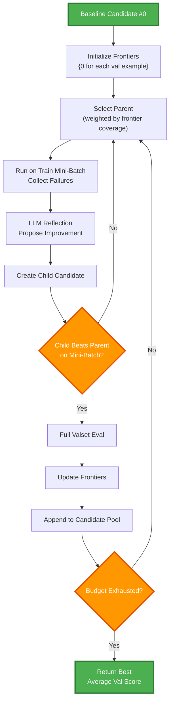

# About GEPA


!!! info "Official Repository:"
    GEPA (Genetic-Pareto) is a framework for optimizing arbitrary systems composed of text components—like AI prompts, code snippets, or textual specs—against any evaluation metric. It employs LLMs to reflect on system behavior, using feedback from execution and evaluation traces to drive targeted improvements. Through iterative mutation, reflection, and Pareto-aware candidate selection, GEPA evolves robust, high-performing variants with minimal evaluations, co-evolving multiple components in modular systems for domain-specific gains.

    Learn more at the [official GEPA repository](https://github.com/gepa-ai/gepa)

## Core Mechanics

GEPA maintains two structures:

| Structure            | Meaning                                                                                           |
| -------------------- | ------------------------------------------------------------------------------------------------- |
| **Candidate Pool**   | Append-only list of all tried programs (index 0 = baseline).                                      |
| **Pareto Frontiers** | One frontier per validation example; each stores candidate indices **tied for best** on that example. |

Optimization Loop (simplified)

```bash
1. Initialize:
   - Candidate pool = [baseline program #0]
   - Frontiers = {0} for each validation example

2. Loop until budget exhausted:
   - Pick a parent from frontiers (weighted by coverage)
   - Sample a mini-batch from trainset
   - Run parent on mini-batch, collect traces
   - LLM reflects on failures, proposes new instruction
   - Create child candidate with new instruction
   - If child beats parent on mini-batch → evaluate on full valset
   - Update frontiers, append child to pool
   - Optionally attempt merge

3. Return candidate with highest average score on valset

```

___

## Process Diagram

<details>
<summary>Click to expand process flow diagram</summary>



</details>

___

## Frontier Logic: Specialists Survive

* A candidate that is best on any example enters that example’s frontier—even if weak elsewhere.
* This keeps specialists alive, enabling exploration that pure average-based selection would kill.
* Parent selection favors candidates appearing in many frontiers (generalists), but still samples specialists.

GEPA maintains N frontiers, one for each validation example. Each frontier stores the indices of candidates that are tied for best on that specific example.

```bash
val_0: {5, 9}      # candidates 5 and 9 both score best on val example 0
val_1: {10, 14}    # candidates 10 and 14 both score best on val example 1
val_2: {15}        # candidate 15 alone scores best on val example 2
...

```

___

## Mini-Batch vs. Full Evaluation

GEPA uses mini-batches for speed

| Phase           | Data          | Purpose                                   |
| --------------- | ------------- | ----------------------------------------- |
| Reflection      | Mini-batch    | Produce failure traces → new instructions |
| Accept gate     | Mini-batch    | Child must beat parent locally            |
| Full evaluation | Entire valset | Update frontiers + scoring                |

___

## Budget = Metric Calls

GEPA’s budget counts every metric call (train + val).
Large valsets consume budget quickly, reducing exploration; small but well-chosen sets expand it.

Smaller valsets let you explore more.

If your valset has 100 examples and you accept 10 candidates, that’s 1,000 metric calls just for validation. With a 20-example valset, same scenario costs 200 calls. The savings go toward trying more candidates.

GEPA logs mention this: `consider smaller valsets if you want broader exploration.`

___

## Valset Composition Matters Most

* Each validation example defines its own frontier → its own niche for specialists.
* A diverse valset creates diverse exploration paths.
* Redundant examples collapse into identical pressures, overweighting that pattern.

___

## Specialists vs. Generalists

* During optimization: specialists persist (frontier membership).
* At the end: GEPA returns the best generalist (highest average val score).
* Specialists broaden the search; generalists win the race.

___

## Designing a Metric

* GEPA optimizes a single scalar value
* Feedback text guides reflection

```python

def metric(
    data_inst: DataInstWithInput[QueryInput],
    output: RolloutOutput[QueryOutput],
) -> tuple[float, str | None]:

    # Check if the agent execution was successful
    if not output.success or output.result is None:
        return 0.0, output.error_message or "Agent failed to produce output"

    ground_truth = data_inst.metadata.get("label")
    output_data = output.result

    accuracy = compute_accuracy(ground_truth, output_data)
    latency = measure_latency(ground_truth, output_data)
    tokens = count_tokens(ground_truth, output_data)

    # Only reward accuracy if latency is acceptable
    if latency > 500:  # ms threshold
        score = 0
        feedback = f"Too slow ({latency}ms). Accuracy irrelevant if latency exceeds 500ms."
        return score, feedback
    
    # Normalize and combine
    score = (
        0.6 * accuracy 
        - 0.2 * (latency / max_latency) 
        - 0.2 * (tokens / max_tokens)
    )
    
    feedback = f"Accuracy: {accuracy}, Latency: {latency}ms, Tokens: {tokens}"
    if score < 0.5:
        feedback += f"Prior Incorrect Reasoning: {output_data.reasoning}"
    return score, feedback
```

