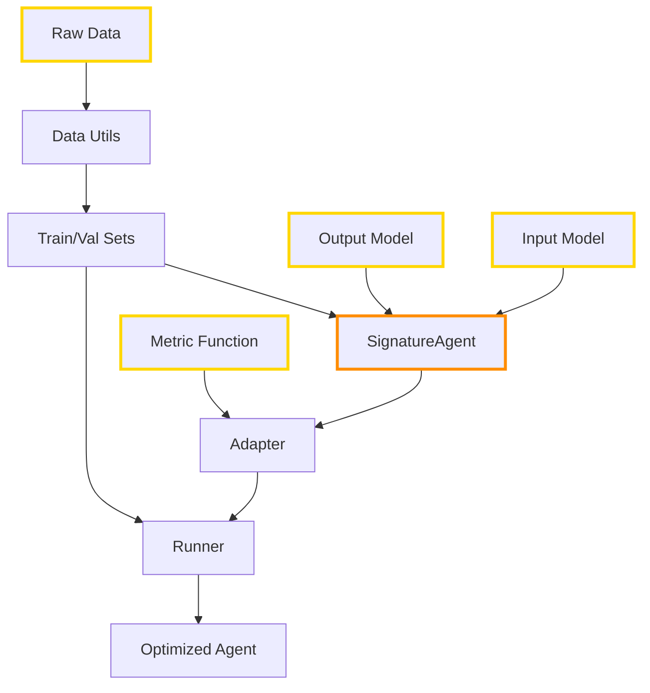

# Core Components

GEPAdantic provides a bridge between [pydantic-ai](https://github.com/pydantic/pydantic-ai) agents and the [GEPA](https://github.com/stanfordnlp/dspy) optimization engine.

## Overview

The simplest optimization workflow in GEPAdantic is this:

1. Define: 
    * **Input** and **Output** models (pydantic BaseModel)
    * A **metric** that returns a score and feedback
    * Optionally define a `SignatureAgent`
2. **Prepare data** using utilities from `data_utils`
3. Create a **`GepaConfig`** for your experiment
4. Execute **`optimize_agent_prompts`**

## Optimization Workflow

_User responsibility is highlighted in <span style="color:#ffd700">**yellow**</span>, with <span style="color:#ff8c00">**orange**</span> being optional_



## Components

### [Scaffold](scaffold.md)

!!! tip "Recommended Approach"
    The config-based scaffold is the **preferred method** for most users. It provides a simple, declarative API that handles all the complexity behind the scenes. Use the lower-level components (`SignatureAgent`, `PydanticAIGEPAAdapter`) only when you need fine-grained control over the optimization process.

A config-based convenience wrapper that simplifies setup and execution. It handles `SignatureAgent` creation, `PydanticAIGEPAAdapter` setup, and runner configuration through a single `GepaConfig` object.


```python
from gepadantic import GepaConfig, run_optimization_pipeline

config = GepaConfig(
    agent_model="gpt-4.1-mini",
    input_type=InputModel,
    output_type=OutputModel,
    trainset=trainset,
    valset=valset,
    metric=metric,
    auto="light"
)

# Check the budget before running
config.estimated_metric_calls
#> 60

result = run_optimization_pipeline(config)
```


### [SignatureAgent](signature-agent.md)

A wrapper around pydantic-ai agents that adds structured input support. Define a pydantic-ai `Agent` with an `output_type`, then wrap it in a `SignatureAgent` along with an `input_type`.

```python
from pydantic_ai import Agent
from gepadantic import SignatureAgent
from gepadantic.lm import get_openai_model

llm = get_openai_model()

base_agent = Agent(
    model=llm,
    output_type=QueryOutput,
)

class QueryInput(BaseModel):
    question: str = Field(description="The question to answer")
    context: str = Field(description="Relevant context")

agent = SignatureAgent(base_agent, input_type=QueryInput)

config = GepaConfig(
    agent=agent,
    input_type=InputModel,
    output_type=OutputModel,
    trainset=trainset,
    valset=valset,
    metric=metric,
    auto="light"
)

```

!!! note "Note on config-based scaffolding"

    - The `GepaConfig` accepts either:
        - `agent_model` deployment name to use for the `Agent` being optimized.
        - A `SignatureAgent` instance, useful for customizing the LLM or for more complex agents, e.g., tool calling, mcp servers, etc.

    If `agent_model` name is passed to the config, the `SignatureAgent` will be constructed automatically


### [Data Utils](data-utils.md)

Helper functions to convert common data formats into GEPA-compatible datasets, e.g., `DataInstWithInput` and `RolloutOutput`.

Example df helper:

- Define input pydantic model
- Define a row mapper helper function


```python
import pandas as pd
from pydantic import BaseModel, Field
from gepadantic.data_utils import dataframe_to_dataset

class ClassificationInput(BaseModel):
    text: str = Field(description="Input text")
    category: str = Field(description="Text category")

# Create DataFrame
df = pd.DataFrame({
    "id": [1, 2, 3],
    "text": [
        "The stock market rose today",
        "New smartphone released",
        "Team wins championship"
    ],
    "category": ["finance", "technology", "sports"],
    "true_label": ["finance", "tech", "sports"],
    "source": ["news_api", "blog", "news_api"]
})

def row_to_input(row) -> ClassificationInput:
    """Convert DataFrame row to input model"""
    return ClassificationInput(
        text=row["text"],
        category=row["category"]
    )

dataset = dataframe_to_dataset(
    df=df,
    row_mapper=row_to_input,
    metadata_cols=["true_label", "source"],
    case_id_col="id"
)
```

### [Adapter](adapter.md)

The `PydanticAIGEPAAdapter` bridges pydantic-ai with GEPA's optimization API. It handles:

- Evaluating candidates on data batches
- Capturing execution trajectories for reflection
- Building reflection datasets
- Proposing new candidates based on feedback

!!! note

    - GEPAdantic's runner function handles the adapter behind the scenes for convenience
    - Users only need to work with the adapter directly if they need fine-grained control over the GEPA integration

```python
from gepadantic import PydanticAIGEPAAdapter

adapter = PydanticAIGEPAAdapter(
    agent=agent,
    metric=metric_function,
    input_type=InputModel
)
```

### [Runner](runner.md)

The `optimize_agent_prompts` function executes the `gepa.api.optimize` main function. It manages:

- Extracting the initial seed candidate
- Setting the budget for GEPA
- Configures the adapter and optionally cache
- Initialize the LLM used internally by GEPA for reflection
- Construct optimization output


```python
from gepadantic import optimize_agent_prompts

result = optimize_agent_prompts(
    adapter=adapter,
    trainset=train_data,
    valset=val_data,
    ...  # GEPA configuration
)
```

## Common Patterns

### Pattern 1: Quick Experimentation

Use `GepaConfig` for rapid iteration:

```python
config = GepaConfig(
    agent_model="gpt-4.1-mini",
    input_type=InputModel,
    output_type=OutputModel,
    trainset=trainset,
    valset=valset,
    metric=metric,
    max_full_evals=5,
)

result = run_optimization_pipeline(config)
```

### Pattern 2: Custom Agent

Use `SignatureAgent` and `GepaConfig`:

```python

tool_calling_agent = Agent(
    model=llm, # <-- Any pydantic-ai `Model`
    output_type=QueryOutput,
)
@tool_calling_agent.tool 
def roll_dice() -> str:
    """Roll a six-sided die and return the result."""
    return str(random.randint(1, 6))

sig_agent = SignatureAgent(tool_calling_agent, input_type=QueryInput)

config = GepaConfig(
    agent=agent,
    input_type=InputModel,
    output_type=OutputModel,
    trainset=trainset,
    valset=valset,
    metric=metric,
    auto="light"
)
result = run_optimization_pipeline(config)
```

## Next Steps

- Learn about [SignatureAgent](signature-agent.md) for structured inputs
- Understand [Adapter](adapter.md) for GEPA integration
- Explore [Runner](runner.md) for optimization workflows
- Simplify with [Scaffold](scaffold.md) for quick setup
- Prepare data with [Data Utils](data-utils.md)
