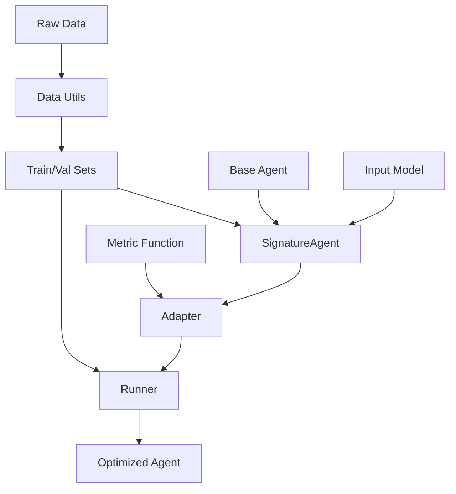

# Core Concepts

GEPAdantic provides a bridge between [pydantic-ai](https://github.com/pydantic/pydantic-ai) agents and the [GEPA (Genetic Pareto)](https://github.com/stanfordnlp/dspy) optimization engine. This page covers the core components of the library.

## Overview

The simplest optimization workflow in GEPAdantic is this:

1. **Prepare data** using utilities from `data_utils`
2. Create a **`GepaConfig`** for your experiment
3. Execute **`optimize_agent_prompts`**

## Core Components

### [Scaffold](scaffold.md)

!!! tip "Recommended Approach"
    The config-based scaffold is the **preferred method** for most users. It provides a simple, declarative API that handles all the complexity behind the scenes. Use the lower-level components (adapter, runner) only when you need fine-grained control over the optimization process.

A config-based convenience wrapper that simplifies setup and execution. It handles agent creation, adapter setup, and runner configuration through a single config object.

**Key Features:**

- Single configuration object
- Automatic agent creation
- Budget setting options and logic
- Simplified API with access to lower level parameters


```python
from gepadantic import GepaConfig, run_optimization_pipeline

config = GepaConfig(
    agent_model="gpt-4o-mini",
    input_type=InputModel,
    output_type=OutputModel,
    trainset=trainset,
    valset=valset,
    metric=metric,
    auto="light"
)

# Check the budget before running
config.estimated_metric_calls
#> 60

result = run_optimization_pipeline(config)
```


### [SignatureAgent](signature-agent.md)

A wrapper around pydantic-ai agents that adds structured input support. Instead of passing raw strings, you define a Pydantic model for your inputs with field descriptions that GEPA can optimize.

**Key Features:**

- Type-safe structured inputs
- Optimizable field descriptions
- Compatible with all pydantic-ai features
- Works with both sync and async execution

```python
from gepadantic import SignatureAgent

class QueryInput(BaseModel):
    question: str = Field(description="The question to answer")
    context: str = Field(description="Relevant context")

agent = SignatureAgent(base_agent, input_type=QueryInput)
```

!!! note "Note on config-based scaffolding"

    - The `GepaConfig` accepts either:
        - `agent_model` string name of the (student) model
        - A `SignatureAgent` instance, useful for more complex agents, e.g., tool calling, mcp servers, etc.

    If `agent_model` name is passed to the config, the `SignatureAgent` will be constructed automatically

### [Adapter](adapter.md)

The `PydanticAIGEPAAdapter` bridges pydantic-ai with GEPA's optimization API. It handles:

- Evaluating candidates on data batches
- Capturing execution trajectories for reflection
- Building reflection datasets
- Proposing new candidates based on feedback

!!! note

    - GEPAdantic's runner function handles the adapter behind the scenes for convenience
    - Users only need to work with the adapter directly if they need fine-grained control over the GEPA integration

```python
from gepadantic import PydanticAIGEPAAdapter

adapter = PydanticAIGEPAAdapter(
    agent=agent,
    metric=metric_function,
    input_type=InputModel
)
```

### [Runner](runner.md)

The `optimize_agent_prompts` function executes the `gepa.api.optimize` main function. It manages:

- Extracting the initial seed candidate
- Setting the budget for GEPA
- Configures the adapter and optionally cache
- Initialize the LLM used internally by GEPA for reflection
- Construct optimization output


```python
from gepadantic import optimize_agent_prompts

result = optimize_agent_prompts(
    adapter=adapter,
    trainset=train_data,
    valset=val_data,
    ...  # GEPA configuration
)
```

### [Data Utils](data-utils.md)

Helper functions to convert common data formats into GEPA-compatible datasets. Handles:

- Input model construction from json or pandas df
- Metadata attachment

**Key Features:**

```python
from gepadantic.data_utils import prepare_train_val_sets

trainset, valset = prepare_train_val_sets(
    data=[{'text': 'example', 'label': 'positive'}, ...],
    input_model=InputModel,
    input_keys=['text'],
    metadata_keys=['label'],
    train_ratio=0.7
)
```

## Optimization Workflow

Here's how the components work together:



### Step-by-Step Process

1. **Data Preparation**
    - Convert raw data to GEPA format using `data_utils`
    - Split into training and validation sets

2. **Agent Setup**
    - Create base pydantic-ai agent
    - Wrap with `SignatureAgent` for structured inputs
    - Define input/output models

3. **GEPA Configuration**
    - Create `GepaConfig`

4. **Optimization Execution**
    - Call `run_optimization_pipeline` to run optimization

5. **Result Application**
    - Extract best candidate from results
    - Apply to your use case agent

## Design Philosophy

GEPAdantic is designed with these principles:

### 1. **Minimal Abstraction**

We rely on the canonical GEPA API rather than reimplementing the optimization engine. This means:

- Updates to GEPA automatically benefit GEPAdantic
- You can use GEPA's original algorithm and methods
- The codebase stays focused on the pydantic-ai bridge

### 2. **Type Safety**

Leveraging Pydantic's type system throughout:

- Input/output validation
- Type hints on all public APIs
- Runtime type checking where appropriate

### 3. **Flexibility**

Multiple entry points for different use cases:

- High-level: `GepaConfig` based scaffolding for frictionless start
- Mid-level: `optimize_agent_prompts` to call the GEPA api
- Low-level: `PydanticAIGEPAAdapter` for custom integration

### 4. **Transparency**

Clear visibility into what's being optimized:

- Named components (e.g., "signature:InputModel:field:desc")
- Detailed trajectory capture
- Usage tracking and reporting

## Common Patterns

### Pattern 1: Quick Experimentation

Use `GepaConfig` for rapid iteration:

```python
config = GepaConfig(
    agent_model="gpt-4o-mini",
    input_type=InputModel,
    output_type=OutputModel,
    trainset=trainset,
    valset=valset,
    metric=metric,
    auto="light"  # 3 rounds, batch size 10
)

result = run_optimization_pipeline(config)
```

### Pattern 2: Custom Optimization

Use `optimize_agent_prompts` and `PydanticAIGEPAAdapter` for fine control:

```python
adapter = PydanticAIGEPAAdapter(
    agent=agent,
    metric=metric,
    reflection_sampler=custom_sampler,
    cache_manager=cache
)

result = optimize_agent_prompts(
    adapter=adapter,
    trainset=trainset,
    valset=valset,
    # ... other GEPA settings
    }
)
```

### Pattern 3: Caching for Development

Enable caching during development:

```python
from gepadantic.cache import CacheManager

cache = CacheManager(
    cache_dir="./my_cache",
    enabled=True,
    verbose=True,    
)

adapter = PydanticAIGEPAAdapter(
    agent=agent,
    metric=metric,
    cache_manager=cache
)
```

## Next Steps

- Learn about [SignatureAgent](signature-agent.md) for structured inputs
- Understand [Adapter](adapter.md) for GEPA integration
- Explore [Runner](runner.md) for optimization workflows
- Simplify with [Scaffold](scaffold.md) for quick setup
- Prepare data with [Data Utils](data-utils.md)
